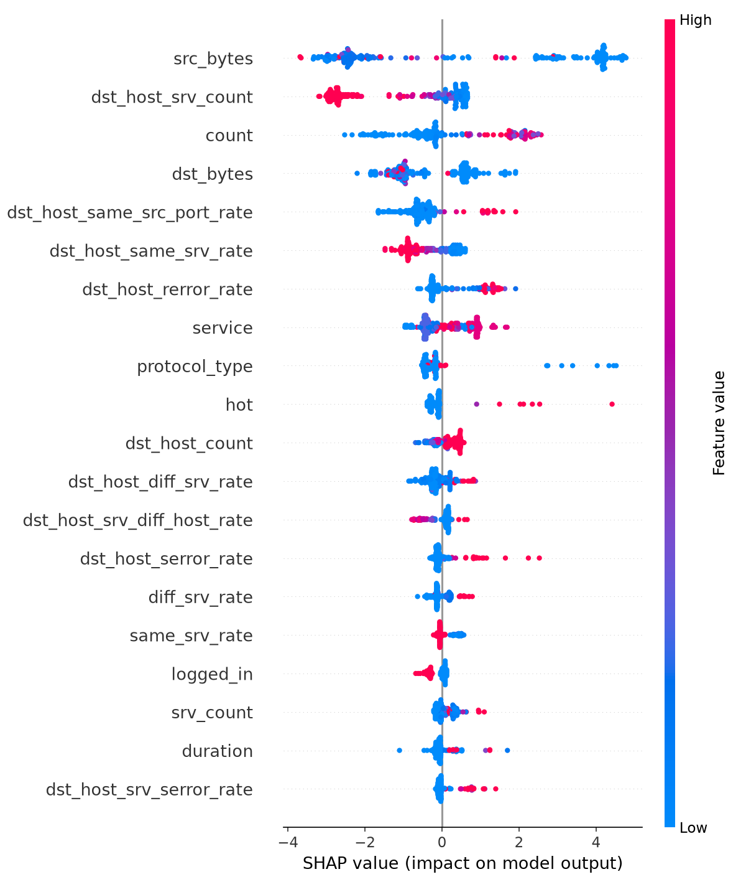

# 🛡️ IBM -- AI-Based Cyber Threat Detection Framework

An AI/Machine Learning-based framework for detecting cyber threats and network intrusions in real-time by analyzing network traffic patterns and classifying them as **Normal** or **Attack**.

> Internship Project — IBM

---

## 🎯 Aim

To design and develop an AI/ML-based framework capable of accurately detecting cyber threats and network intrusions in real-time, by analyzing network traffic patterns and classifying them as normal or malicious activity — thereby enhancing the speed and accuracy of threat detection compared to traditional rule-based security systems.

## 📌 Objectives

- Detect network intrusions (DoS, Probe, R2L, U2R) using ML models trained on network traffic data
- Compare multiple ML algorithms and select the best-performing one
- Minimize false positives while maintaining high recall
- Build a real-time detection pipeline for new/live traffic
- Provide a monitoring interface to visualize detected threats

---

## 📊 Dataset

**NSL-KDD** — a benchmark intrusion detection dataset (improved version of KDD Cup 1999).

- **Training set**: ~1,25,973 records
- **Test set**: ~22,544 records
- **Features**: 41 network traffic attributes (duration, protocol_type, service, flag, byte counts, error rates, etc.)
- **Labels**: `normal` or one of ~22 attack types, grouped as DoS, Probe, R2L, U2R
- Used as a **binary classification** problem: `0 = Normal`, `1 = Attack`

---

## 🗂️ Repository Structure
IBM--AI-Based-Cyber-Threat-Detection-Framework/
├── data/               # Raw NSL-KDD dataset
├── models/             # Model comparison results, plots
├── outputs/            # Generated: trained model, scaler, encoders (.pkl)
├── assets/             # Images used in this README (SHAP plot, etc.)
├── scripts/
│   ├── preprocess.py           # Data cleaning, encoding, scaling, SMOTE
│   ├── train_models.py         # Model training + evaluation
│   ├── real_time_detection.py  # Real-time detection simulation
│   ├── explain.py              # SHAP explainability
│   └── dashboard.py            # Streamlit live monitoring dashboard
├── .gitignore
├── requirements.txt
└── README.md

---

## ⚙️ Pipeline / Methodology

**1. Data Preprocessing**
- Load raw NSL-KDD data and assign column names
- Remove duplicates and handle missing values
- Encode categorical features (`protocol_type`, `service`, `flag`)
- Create binary label (Normal = 0, Attack = 1)
- Scale numeric features using `StandardScaler`
- Balance classes using `SMOTE` (applied to training data only)

**2. Model Building**
Three models were trained and compared:
| Model | Purpose |
|---|---|
| Logistic Regression | Baseline model |
| Random Forest | Stronger ensemble model, gives feature importance |
| XGBoost | Advanced gradient boosting, best performer |

**3. Evaluation**
Models are evaluated using Accuracy, Precision, Recall, F1-Score, ROC-AUC, and False Positive Rate — with special attention to **False Positive Rate**, since excessive false alarms reduce analyst trust in real-world security systems.

**4. Real-Time Detection**
The best-performing model is wrapped into a `detect_threat()` function that takes a single raw network connection record and returns a prediction (`Normal`/`Attack`) with a confidence score and severity level, simulating a live monitoring feed.

---

## 📈 Results

| Model | Accuracy | Precision | Recall | F1-Score | ROC-AUC | False Positive Rate |
|---|---|---|---|---|---|---|
| **XGBoost (Best)** | 80.5% | 96.9% | 67.9% | 79.8% | 96.6% | 2.9% |
| Random Forest | 76.8% | 96.6% | 61.4% | 75.0% | 96.3% | 2.9% |
| Logistic Regression | 75.6% | 92.5% | 62.1% | 74.3% | 87.4% | 6.7% |

**XGBoost** was selected as the final model — highest F1-score and ROC-AUC, with a low false positive rate suitable for real-world intrusion detection.

---

## 🔍 Explainability (SHAP)

To ensure analyst trust, the model's predictions are explained using **SHAP** (SHapley Additive exPlanations). This identifies which network traffic features (e.g., `src_bytes`, `count`, `serror_rate`, `dst_host_srv_count`) most influenced each prediction — critical for real-world SOC adoption, where black-box alerts are not trusted by analysts.



Each prediction can also be explained individually — the top 3 contributing features are printed for any given network record, helping analysts understand *why* a connection was flagged as an attack.

---

## 🛠️ Tools & Technologies

| Library | Purpose |
|---|---|
| pandas, numpy | Data loading and manipulation |
| scikit-learn | Preprocessing, models, evaluation metrics |
| imbalanced-learn | SMOTE for class imbalance |
| xgboost | Gradient boosting classifier |
| shap | Model explainability |
| joblib | Saving/loading trained model, scaler, encoders |
| matplotlib, seaborn | Visualizations (confusion matrix, feature importance, SHAP) |
| streamlit, plotly | Live monitoring dashboard |

---

## 🖥️ Dashboard Preview

### Dashboard Home


### Live Detection in Action


The dashboard provides a real-time visualization of network traffic by classifying packets as **Normal** or **Attack**. It displays confidence scores, threat severity levels, traffic distribution through interactive charts, and a live detection log, simulating a Security Operations Center (SOC) monitoring dashboard.

---

## ▶️ How to Run

```bash
# 1. Clone the repository
git clone https://github.com/tomerarvind195-byte/IBM--AI-Based-Cyber-Threat-Detection-Framework.git
cd IBM--AI-Based-Cyber-Threat-Detection-Framework

# 2. Install dependencies
pip install -r requirements.txt

# 3. Run the pipeline in order
python scripts/preprocess.py
python scripts/train_models.py
python scripts/real_time_detection.py
python scripts/explain.py

# 4. (Optional) Launch the live dashboard
streamlit run scripts/dashboard.py
```

---

## 🚀 Future Scope

- Multi-class classification to identify specific attack types (DoS, Probe, R2L, U2R)
- Deep learning models (LSTM, Autoencoders) for zero-day attack detection
- Integration with real/live network traffic instead of a static dataset
- Integration with IBM QRadar (SIEM) and IBM Watson for enterprise deployment
- Automated response system (e.g., auto-blocking suspicious IPs)
- Cloud deployment for scalable, multi-location monitoring
- Continuous learning to adapt to evolving attack patterns

---

## 👤 Author

**Arvind Kumar**
- GitHub: [@tomerarvind195-byte](https://github.com/tomerarvind195-byte)
- LinkedIn: [arvind-kumar-399a60338](https://www.linkedin.com/in/arvind-kumar-399a60338/)

Internship Project — IBM